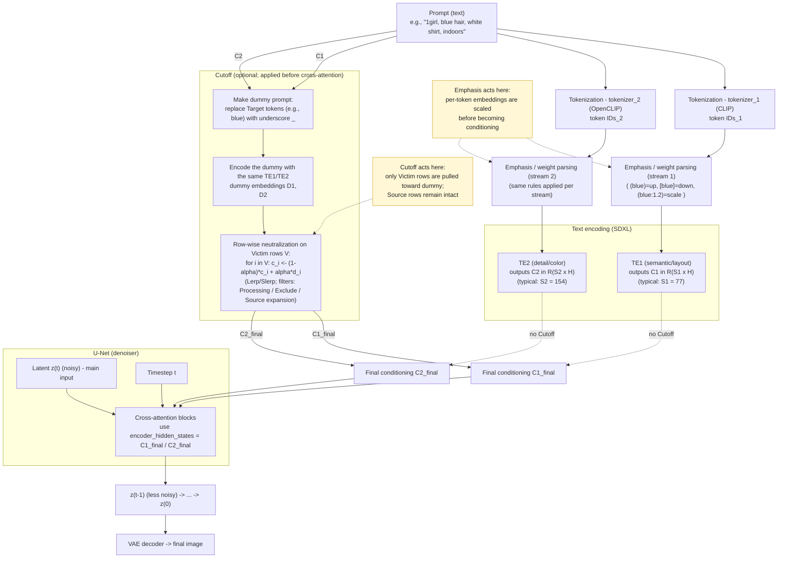
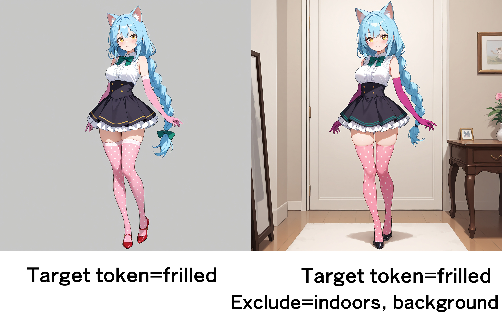

# Forge Cutoff -Cutting off prompt effect for Forge

## これは何？／What is this?
SD WebUI Forge専用の**トークンの影響範囲を操作することでカラーブリード（色移りや概念の混ざり）を防ぐ拡張機能**です。[hnmr293氏のsd-webui-cutoff](https://github.com/hnmr293/sd-webui-cutoff)からヒントを得ました。A1111 SD WebUIに存在したAPIの多くがForgeでは廃止されており、そのままでは移植できなかったため、Forge版Cutoffを新規開発しました。
> An SD WebUI Forge–only extension that prevents color bleed (unwanted color transfer / concept mixing) by controlling the influence range of specific tokens. It’s inspired by [hnmr293/sd-webui-cutoff](https://github.com/hnmr293/sd-webui-cutoff)


---
## 使い方／Usage
1. WebUIのSettingsタブ→User interface→Quicksettings listから、cutoff_forge_enableを選択してください。 **Enable"(sd-forge-cutoff)"** が画面上部に表示されるので、チェックを入れてください。  
2. Target tokensに、色移りを抑制したい単語を入力します。たとえば「`1girl, blue hair, white shirt, indoors`」というプロンプトで、髪の青さがシャツに色移りしているケースなら、「`blue,`」と記入します。  
3. 画像を生成してください。
4. 前回の生成と同じプロンプトでTarget tokensだけを追加・変更すると、Cutoffが機能しなくなります。バッチサイズを変えて生成するか、checkpointモデルを一旦別のものに変えて元に戻すという手動操作をしてください。（理由は後述）  
**注意：** プロンプトには`_`（アンダーバー）を含めないことを推奨。含まれていると、Cutoffの性能が不安定になります。
**Strength α：** cutoffの効きの強さを調整します。高くするほどカラーブリードの抑制力が上がりますが、絵柄崩れのリスクが増します。低くすると絵柄崩れのリスクは減りますが、カラーブリードの抑止力も下がります。

> 1. In Settings → User interface → **Quicksettings list**, add cutoff_forge_enable. Then a **Enable (sd-forge-cutoff)** checkbox appears in the top bar—turn it ON.  
> 2. In **Target tokens**, enter the word(s) whose color bleed you want to suppress. For example, with the prompt `1girl, blue hair, white shirt, indoors`, if the hair’s blue bleeds into the shirt, set `blue,`.
> 3. Generate an image.
> 4. If you only add/modify **Target tokens** while leaving the prompt and settings otherwise unchanged, **Cutoff won’t run**. Change the batch size or temporarily switch the checkpoint and switch back (details below).
> **NOTE:** Avoid using the underscore `_` in prompts. It can make Cutoff unstable.
> **Strength α：** Controls how strongly Cutoff acts. Higher values suppress color bleed more but increase the risk of artifacts; lower values reduce artifacts but may not suppress bleed enough.

---


テストプロンプトA／Test prompt A
```
masterpiece, best quality, absurdres, highres, newest,
BREAK
full body, 1girl, standing, blue hair, yellow eyes, blush smile, animal ears, cat ears, long braid, white shirt, sleeveless, [[ medium breasts, ]] purple elbow gloves, green bowtie, frilled skirt, black skirt, polka dot thighhighs, pale pink thighhighs, red pumps, indoors, white background,

Negative prompt: low quality, worst quality, puffy sleeves, long sleeves, boots, suspenders,

=== === ===
ENSD: 31337,
Module 1: sdxl_vae
Steps: 20,
Sampler: Euler a, Schedule type: Karras,
CFG scale: 4.5, 
Seed: 1942294177, 
Size: 1024x1024, 
Model: IL_waiNSFWIllustrious_v140,

Hires Denoising strength: 0.5,
Hires CFG Scale: 5, 
Hires upscale: 1.5, 
Hires upscaler: R-ESRGAN 4x+ Anime6B, 
```


テストプロンプトB／Test prompt B
```
masterpiece, best quality, absurdres, highres, newest,
BREAK
1girl, grey hair, yellow eyes, dark skin, smile, open mouth, standing, holding umbrella, blue umbrella, pale pink silk blouse, see-through raincoat, purple neon light, green scarf, glossy lips, black leather shorts, red rubber boots, reflective ground, cinematic lighting, rain, night, outdoors, street,

Negative prompt: low quality, worst quality,

=== === ===
ENSD: 31337, 
Module 1: sdxl_vae
Steps: 25, 
Sampler: Euler a, Schedule type: Karras, 
CFG scale: 4.5, 
Seed: 1428688854, 
Size: 1024x1024, 
Model: IL_waiNSFWIllustrious_v140, 
Hires Denoising strength: 0.5, 
Hires CFG Scale: 5, 
Hires upscale: 1.5, 
Hires upscaler: R-ESRGAN 4x+ Anime6B, 
```

---

# 仕組み／How it works
## なぜカラーブリードは生じるのか／Why color bleed happens  
ここでは、たとえば`1girl, blue hair, white shirt, indoors`でシャツまで青くなってしまうケースで考察します。プロンプトでは`white shirt,`と指定しているのに、なぜ髪の色がシャツに混色してしまうのでしょうか？ 　
> Take `1girl, blue hair, white shirt, indoors` as an example where the shirt turns bluish even though we specified `white shirt`. Why does the hair color spill onto the shirt?

### (a) プロンプト → 最終コンディショニング行列／Prompt → final conditioning matrix  
文字情報で書かれたプロンプトは、そのままでは**U-net（Stable Diffusionの心臓部）**では読み込めません。プロンプトのテキストをまずトークン化し、さらにU-netが読み込み可能な**テンソル（数値データのセット）**に変換する必要があります。
SDXLの場合、各トークンが**テキストエンコーダ（TE1/TE2の2系統）**を通って、最終的に **S×H** の**行列 C**（S=トークン列長、H=隠れ次元）になります。この C が U-Net のクロスアテンションの **“文脈（context）”**として、全層・全ステップで参照されます。  
*（※文系ユーザー向けのメモ：テンソルとは、噛み砕いていえば「ひとまとまりの数値データのセットを並べたもの」のことです。一次元のテンソルをベクトル、二次元のテンソルを行列と呼びます。）* 　
>A text prompt can’t be fed to the **U-Net** directly. It is **tokenized** then converted into numeric tensors that U-Net can read.
>In SDXL, tokens pass through **two text encoders (TE1/TE2)** and form a final matrix **C** of shape **S×H** (S = sequence length, H = hidden size). This C is referenced as context by the U-Net’s cross-attention at every layer and step.
>*(Note for non-engineers: a tensor is a “multi-axis table of numbers.” 1-D = vector, 2-D = matrix.)*

### (b) “色語”は部位を知らない／“Color words” don’t know body parts  
`blue` は **「色の概念ベクトル」** ですが、髪かシャツかを単独で判別しません。モデルはクロスアテンションで「画像のどこに `blue` を割り当てるか」を**確率的に決めます**。 `hair`が一緒にあれば`blue`を適用すべき位置のヒントにはなりますが、以下の理由で**漏れ（ブリード）**がしばしば生じます。
- **共起バイアス：** 学習データに「青い髪」と「青い服」が同時に描かれた画像が多かった（偏りがあった）場合 → `blue` が衣服トークン（`shirt`）にも**弱く結びつきます**。
- **アテンションの拡散：** クロスアテンションは各トークンの相互の影響を完全に分離することはできないため、`blue` の影響が「髪」以外のトークン行（`shirt`, `indoors` など）にも混入することがあります。
- **位置依存の弱さ：** 文法上の近接（blue の直後に hair）は手がかりになりますが、完全ではありません。クロスアテンションの仕組み上、単語の位置を完全に分離することはできません。 　

> `blue` is a **color concept vector**—it does not, by itself, know whether it should apply to hair or shirt. Cross-attention probabilistically decides **where** to attribute `blue`. Having `hair` nearby helps localize, but bleed still occurs because:
> - **Co-occurrence bias:** If training images often depict **blue hair and blue clothes together**, `blue` can **weakly associate** with shirt as well.
> - **Attention spill:** Cross-attention can’t perfectly isolate token effects; `blue` can leak into token rows like `shirt` or `indoors`.
> - **Limited positional cues:** Being adjacent (`blue` right before `hair`) is only a hint—positions aren’t perfectly separable.  

結果として、U-Net側のクロスアテンションは「髪の他にシャツにも blue の重みを少し載せる」→ 生成像でシャツに青が載ってしまう、という“カラーブリード”が生じるわけです。
> As a result, U-Net may place a small `blue` weight on **shirt** as well as **hair**, causing **color bleed**.

---

## sd-forge-cutoffの機能／What sd-forge-cutoff does
　sd-forge-cutoffでは、まず、ターゲットに指定された語（青の色移りを防ぎたいなら`blue`）を`_`（アンダーバー）に置き換えて、**ダミープロンプト**を作ります。そして、**本物のプロンプトから作られたテンソルを、ダミーから作られたテンソルで中和**することで、カラーブリードを抑制します。もう少し詳しく説明すると、以下の通りです：
> We first create a **dummy prompt** by replacing the target word (e.g., blue) with _, then **neutralize the real prompt’s tensor with the dummy’s** to suppress color bleed.

### (a) 2つのコンディショニングを作る／Build two conditionings
- **元の最終行列：C_orig**（`blue` を含む行列）
- **ターゲット（blue）だけを `_` に置き換えたダミープロンプトから得た行列：C_dummy**（`blue` の寄与が取り除かれた行列）    
ここで **`_` は意味が薄い記号**であり、他のトークンへの影響はごくわずかです。したがって、差分 (C_orig − C_dummy) は、ほぼ「`blue` 由来の成分」を表します。  
（※ギーク向けのメモ：つまり`_`は、パディングの簡易な代替です。）  
> - Original: C_orig (contains `blue`)  
> - Dummy: C_dummy (obtained by replacing only blue with _)
>  
>`_` carries little meaning, so the difference (**C_orig − C_dummy**) approximates the `blue` contribution.  
>*(Geek note: `_` is a practical stand-in for padding.)*  


### (b) 「影響を切りたい行（Victim）」だけを置き換える／Replace only the rows you want to damp (Victim)
`shirt` や `indoors` など Victim 行集合 V に対してだけ、C を次のように更新します（Lerp の場合）：
> For Victim rows V (e.g., `shirt`, `indoors`), update C (Lerp case):   
  
```math
C_{\text{final}}[V] \;=\; (1-\alpha)\, C_{\text{orig}}[V] \;+\; \alpha \, C_{\text{dummy}}[V]
```
  
Slerp を使う場合は、向き（方向）を保ったまま大きさを補間しますが、本質は同じです：  
“元の行ベクトルから、`blue` に相当する成分だけを部分的に抜く” という操作になります。  
> With **Slerp**, we move along the spherical arc (preserving direction better), but the idea is the same: **partially subtract the `blue` component only from Victim rows.**  

### (c) 何が起きるか（アテンション経路の遮断）／What this changes (cutting the attention path)
U-Net のクロスアテンションは C の各行を Keys/Values として参照します。  
Victim 行を C_dummy へ寄せることで、その行が持っていた `blue` 方向の情報が弱まり、  
- `shirt` 行 → `blue` への結びつきが薄くなる  
- `hair` 行 → 置き換えないので `blue` はそのまま強く残る  

という **“局所的な引き算”**が実現します。結果、`blue` の影響経路を 「髪」には残しつつ、「シャツ」では弱められる → ブリードが減る、というメカニズムです。  
> U-Net uses each row of **C** as Keys/Values in cross-attention.By pulling Victim rows toward **C_dummy**, their `blue` direction weakens, so:
> - `shirt` rows: **weakened** association to `blue`
> -  `hair` rows: **unchanged**, keep `blue` strong
>  
> This is a **local, row-wise subtraction**, reducing `blue` on the shirt while keeping it on the hair.

### (d)　プロンプトの**重みづけ表現**と何が違うの？／How is this different from prompt weighting?
Stable Diffuisonでは、`[blue]`や`(blue:0.8)`のような**重みづけ表現**によって、プロンプトの一部の影響を弱められます。このような表記をすると、**プロンプト全体に対する`blue`の影響**が弱まります。  
一方、Cutoffは「特定のトークンには`blue`の影響を残したまま、他の部分への影響を抑える」という挙動が期待できます。  
> Prompt weighting like `[blue]` or `(blue:0.8)` weakens `blue` **globally**, across the whole prompt. Cutoff instead **keeps** `blue` **where you want it** and **suppresses it only where you don’t** (on Victim rows).  



## なぜ手動操作が必要なの？／Why manual refresh is required
sd-forge-cutoffはその仕様上、victimとdummyの行の位置を完全に一致させる必要があります。victim行の中で`blue`の情報がエンコードされている位置と、dummy行の中で`_`の情報がエンコードされてい位置を、ぴったり重ねなければなりません。
A1111 SD WebUIでは`hijack`と名付けられたAPI群により、U-netに入る直前のcondを入手することができたため、victimとdummyを一致させることが比較的容易でした。一方、Forgeでhijack系のAPIが廃止されています。
そこでsd-forge-cutoffでは、Forge本体におけるCTPEキャッシュの作成に依存した設計を選びました。CTPEキャッシュが作成されるときに飛んでくる情報にぶら下がる形で処理を走らせれば、原理上、victimとdummyとをほぼ確実に一致させることができます。  
> sd-forge-cutoff must **align Victim rows and Dummy rows exactly**. The token positions containing `blue` (in Victim) and `_` (in Dummy) must **match 1:1**. In A1111, “hijack” APIs let us grab the conditioning right before U-Net, so alignment was simpler. Forge **removed** those APIs. Therefore sd-forge-cutoff **depends on Forge’s CTPE cache:** when the cache is constructed, we latch onto the information to ensure alignment.

問題は、Forge本体のCTPEキャッシュ作成を、拡張機能側から操作する手段がほぼないことです。  
Forgeはプロンプトなどの設定が同じまま生成を行うと、CTPEキャッシュを使い回します（＝キャッシュが新規に作成されません）。結果、sd-forge-cutoffはCTPEキャッシュの作成を検知できず、処理も走りません。  
ForgeがCTPEキャッシュを作成するのは、主に以下の場合です。
1. プロンプトが（1文字でも）変わったとき  
2. バッチサイズが変わったとき  
3. モデルデータ(checkpoint)が変わったとき  
このうち出力結果への悪影響が少ないものとして、ここでは2. および3.　の手動操作によるキャッシュ更新を推奨しています。  

> The catch: **extensions can’t force CTPE cache rebuilds**. If **prompt/settings are unchanged**, Forge **reuses** the cache—**no new cache, no Cutoff run.**
> CTPE cache typically rebuilds when:
> 1. Prompt changes (even by one character)  
> 2. Batch size changes
> 3. Batch size changes
>  
> To avoid visual shifts, we recommend (2) or (3) as a manual refresh step.

## なぜ`"_"`を含むプロンプトは非推奨なの？／Why prompts containing _ are discouraged   
sd-forge-cutoffでは、プロンプトに`"_"`（アンダーバー）が含まれていると挙動が不安定になります。とくに`blue hair`を`blue_hair`のようにアンダーバーで繋いで表記した場合、期待通りの挙動になりません。  
これは「ターゲットの語（たとえば`blue`）を`_`に置き換える」という仕様のためです。  
`blue hair`は、正しく`_ hair`に置き換えられます。が、`blue_hair`は置換そのものがスキップされます。単語の区切りに基づいてターゲットを検索するため、単語の区切りが`_`で埋められると、`blue`という単語そのものを発見できなくなるからです。結果、victim行とdummy行が一致しなくなります。  
`_`は意味の薄い記号ですが、全く意味がないわけではありません。たとえば、WebUIのプロンプト入力欄の右上にはトークン数の概算が表示されていますが、`blue hair`と`blue_hair`ではトークンの数が変わることを確認できるはずです。基本的には、`_`を含むほうがトークン数は増えます。これは、`_`もトークンとしてエンコードされるため、`_`の有無によって語句をトークン化するときの区切り位置が変わってしまうからです。  
理想を言えば、sd-forge-cutoffは`_`で代替するのではなく、真のパディングを用いるべきです。しかし、真のパディングを提供するAPIはForgeには存在せず、また、その実装難易度は極めて高いため、`_`で代用することにしました。これは本家sd-webui-cutoffと同様の仕様です。  
>  With `_` in the prompt, Cutoff becomes unstable—especially `blue_hair` vs `blue hair`. Cutoff replaces the target word (e.g., `blue`) with `_`.
>  - `blue hair` → correctly becomes `_ hair`
>  - `blue_hair` → replacement is **skipped** (because token boundaries are based on word boundaries, and `_` collapses them), so Victim/Dummy positions **no longer align**.
>  
>  Also, `_` is **not meaningless:** it’s tokenized, can increase token count, and shifts boundaries. Ideally we’d use true padding, but Forge doesn’t expose an API for that and the implementation cost is high—so we use `_`, same as the original sd-webui-cutoff.

---
## Advanced
sd-forge-cutoffでは、仕様を理解しているユーザーに向けて以下のAdvanced機能を用意しました。  
>  Advanced options for users who understand the mechanism:

1. Source Expansion (±N)
2. Exclude from processing
3. Processing target
4. Apply to TE1/TE2
5. Interpolation Lerp/Slerp
6. Sanity test (for debug)

### Source Expansion (±N)
sd-forge-cutoffは、デフォルトではvictim行の全体を中和対象にします。しかし、たとえば`blue hair`の`blue`をターゲットに指定した場合、そのままではhairまで中和対象となり、本来なら青くしたい髪からも色が抜けてしまうリスクがあります。
そこで、sd-forge-cutoffには「（カンマなどのトークン区切り記号の範囲内で）**前後N個までのトークンを中和から保護する**」という機能をつけました。たとえば`1girl, blue hair, white shirt, indoors`というプロンプトで、ターゲットは`blue`、N=1の場合、`hair`が中和の対象から外されます。もしも`blue long hair`だったなら、N=2を指定することが推奨されます。  
>  By default, **all Victim rows** are neutralized. If the target is `blue` in `blue hair`, the hair could also be neutralized, washing out the very color you want to keep.
>  Source expansion protects **±N tokens in the same comma-bound phrase** near the target.
>  Example: with `1girl, blue hair, white shirt, indoors`, Target=`blue`, N=1 protects `hair`. If it’s `blue long hair`, **N=2** is recommended.

### Exclude from processing
上記のSource Expansion (±N)とは別途で、中和の対象から外したいトークンを指定する機能です。
これは、絵柄崩壊が大きいときに効果を発揮します。
>  Explicitly exclude tokens from neutralization—useful when the image degrades.



たとえば先述のテストプロンプトAで、ターゲットに「`frilled`」を指定した場合、背景が描かれず灰色一色になってしまいます。これは、`frilled`が色語に比べて抽象度の高い意味を持つトークンであり、衣服だけでなく背景にも薄く広く干渉しているためです。Exclude from processingに`indoors, background,`を指定すると、背景の描画が復活します。
> Example: with Test Prompt A and Target=`frilled`, the background can turn gray because `frilled` is abstract and touches background tokens as well. Excluding `indoors, background` recovers the background.

### Processing target
上記のExclude from processingとは逆に、中和の対象を明示したいときに使います。ここに何らかの文字列が入っている場合、victim行の全体を中和するという機能はスキップされ、victim行の中の`Processing target`のトークンがエンコードされた位置のみが中和されます。
**Tips:** ここには「実際にTarget tokensの影響を受けているトークン」を指定する必要があります。たとえばTarget tokens=`blue`、Processing target=`shirt`を指定した場合、もしもシャツのトークンが青のトークンに影響されていなければ、何も中和されず、Enable=offで生成した場合とほぼ同じ出力結果になります。生成結果の見た目では「髪の青さがシャツに影響している」ように見えたとしても、実際にはそうではない（シャツは別の要因で青くなっている）ケースがあるのです。
> The inverse: **restrict** neutralization **only to the tokens listed here**. If this is non-empty, the “neutralize all Victim rows” step is skipped and only positions that match the **Processing targets** are neutralized.
> **Tips:** List tokens **actually under the influence** of the Target tokens. If Target=`blue`, Processing=`shirt`, but the shirt isn’t affected by `blue`, nothing will be neutralized and the result will look like Enable=off.

### Apply to TE1(SD/SDXL)/TE2
SDXLのテキストエンコーダーには、以下２つの系統が存在します。  

- TE1 (Text Encoder 1): CLIP ViT-L/14  
- TE2 (Text Encoder 2): OpenCLIP ViT-bigG/14  
  
一般的には、TE1がプロンプトの「基本的な意味・構図」を理解し、TE2が「詳細なスタイル・質感」を補うとされています。  
sd-forge-cutoffでは、デフォルトではこれら2系統の両翼で中和の処理を走らせます。Apply to TE1/TE2を操作することで、これを1系統ずつ選択できます。  
> SDXL has two text-encoder systems:
> - TE1 (Text Encoder 1): CLIP ViT-L/14  
> - TE2 (Text Encoder 2): OpenCLIP ViT-bigG/14.
> 
>  A common rule of thumb: **TE1** captures **meaning/layout**, **TE2** adds **style/detail**.
>  By default, sd-forge-cutoff applies to **both**. You can select one via this option.

### Interpolation Lerp/Slerp
中和処理の計算方法を選択します。ざっくりいうと、Lerp は「まっすぐ混ぜる」線形補間、Slerp は「方向を保ったまま回す」球面補間です。私の実験では、Slerpのほうがカラーブリード抑制の性能が高く、ポーズなども崩れにくいという印象です。一方、Lerpには計算が軽いという利点がありますが、現代の高性能なデバイスでは処理時間の差は軽微であり、カラーブリード抑制という目標から考えると優位性をあまり感じません。
>  Chooses the mixing method. Roughly:  
>  - Lerp: linear mix (lighter, but can “wash out” under strong α)  
>  - Slerp: spherical mix (preserves direction; more robust under strong α)
>  
>  In our testing, **Slerp* tends to suppress bleed better while keeping pose stable. Lerp is lighter but the runtime difference is usually negligible on modern devices.

##　Sanity test (for debug)  
Forgeの画像生成経路にこの拡張機能が干渉できているかどうかを確認するための、デバッグ用の機能です。プロンプト末尾の **N% のトークンを丸ごと** 中和します。*Target / Exclude / Processing* は無視されます。**Enable／Strength／Interpolation（Lerp/Slerp）／Apply to TE1/TE2** の効きと、キャッシュ更新の要否を確認する用途です。  
実運用では **OFF** にしてください。
>  Debug aid to verify the pipeline is wired correctly. Temporarily neutralizes the last N% of tokens in the prompt. It **ignores** *Target / Exclude / Processing*, but **Enable / Strength / Interpolation / Apply to TE1/TE2** take effect, and you can also check if a cache refresh is needed.  
> **Turn OFF** for real renders.  

---
## 動作検証／Compatibility & Validation
この拡張機能は、StabilityMatrix版SD WebUI Forgeで動作検証しています。A1111では動作しません。一方、Forgeファミリーでは動作する可能性があります。  
- `backend.text_processing.classic_engine`モジュールが存在し、`__call__`メソッドがパッチ可能であること。  
- `backend.sampling.condition`モジュールが存在し、`ConditionCrossAttn.process_cond`メソッドがパッチ可能であること。
  
以上2つの条件を満たすなら、おそらく動作します。要するに`\stable-diffusion-webui-forge\backend`のディレクトリの内容を改修していなければ動作する可能性が高いです。

> This extension is tested on **SD WebUI Forge (StabilityMatrix build)**. It **does not** run on A1111. It may run on Forge family builds that meet:
> - `backend.text_processing.classic_engine` exists and its `__call__` can be patched.
> - `backend.sampling.condition` exists and `ConditionCrossAttn.process_cond` can be patched.  
>  
> In short, if your `\stable-diffusion-webui-forge\backend` directory hasn’t been modified, there’s a good chance it will work.    

---
## 謝辞／Acknowledgments
この拡張機能は、[hnmr293氏によるsd-webui-cutoff](https://github.com/hnmr293/sd-webui-cutoff)の素晴らしいコンセプトとアルゴリズムに強くインスパイアされています。  
Forgeのアーキテクチャ（`hijack` APIの廃止）に対応するため、`sd-webui-cutoff`のU-Netフックとは異なるアプローチ（CTPEとConditionCrossAttnへのパッチ）で機能を再実装しました。  
偉大な先駆者であるhnmr293氏に、心からの敬意と感謝を申し上げます。  
> This work is strongly inspired by the great concept and algorithm of [sd-webui-cutoff by hnmr293](https://github.com/hnmr293/sd-webui-cutoff).
> To adapt to Forge’s architecture (no `hijack` API), we re-implemented the feature with a different approach (patching **CTPE** and **ConditionCrossAttn**) instead of the original U-Net hook.
> Many thanks and respect to hnmr293 for the pioneering work.
